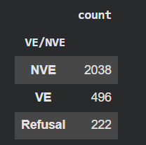

# 
 Assignment 3: Extremism PART 2 - MBDAM Spring 2026

## A - Enhance your previous extremism detection system
#### Based on the reading, according to the author, what are some key differences and similarities between VE and NVE.

The similarities associated with both VE and NVE include:
- Dehumanization is common to both VE and NVE though VE felt a personal
responsibility to act compared to NVE and it does not always lead to physical violence
- The study found that both groups exhibit a strong psychological need for sense of
purpose and that it does not specifically drive violent behavior.
- Both groups used the internet to connect with like-minded individuals where over 80% were connected with others who shared similar radical views.
- Psychological issues and trauma showed no difference between the two groups e.g.., loss of significant other was a trauma experienced by roughly half of both VE’s and NVE’s. They were both in search of identity and desire to belong
- The individuals (NVE and VE) both held the extremist ideology regardless of whether
they were violent or not

Differences associated with both NVE and VE:
- VE were more likely to have been exposed to extreme violence and trauma compared to
NVE’s which include internet materials
- Negative social experiences such as being bullied during adolescence is more common to VE compared to NVE’s
- VE often experienced low self esteem and sense of underachievement in their academic achievements or employment status.
- VE felt strongly the need to act based on their belief compared to NVE’s where they tend to operate in an open environment where there are fewer constraints.
- VE are likely to have attended or travelled abroad to train and meet with others who were more influential. They also were likely to have participated in sports earlier in life.

#### Based on the paper&#39;s method section, how are radicalization and extremism defined?
Most materials propose radicalization as a process whereby a person’s beliefs become more extreme where they define it as the process by which people come to support terrorism and extremism and, in some cases, participate in terrorist activity.

It is also highlighted that though it is perceived as a grounding step for extremism, it is not always the case as it does not always result in violent action.

For extremism, the author describes based on UK Government definition which terms it as the vocal or active opposition of fundamental British values which include democracy, rule of law, individual liberty and mutual respect and tolerance of different faiths and beliefs.

The authors for the research categorize extremists as individuals who hold opposing/contradictory attitudes and opinions from the mainstream regarding political and/or biological issues.

#### How is Violent and non-violent Extremism defined? Use this definition to design your prompt to classify between VE and NVE.

An extremist is defined as someone who had been convicted of a criminal offense whether violent or non-violent and they hold attitudes or beliefs outside of mainstream political or ideological opinion. Then the Violent Extremist (VE) is defined as an individual who as been convicted of an actual violence e.g., acts of murder, murder, assault etc., committing serious damage to structures, having a potential act that would have constituted to violence if not disrupted or facilitation of violence through non-violent acts such as provision of explosives.

Non-Violent extremists are those who have been convicted of criminal offences which do not involve violence or facilitation of violence e.g., possessing a disturbing literature or sending a racist email.

#### Design your sub-type classification prompt. What are some prompt design choices your team has had to make for these questions?
On a first try, gpt-4.1-mini refused to respond to the harmul and violent message, so we had to adjust to allow the model to respond and changed to gpt-5-mini.
the resulting cvs with 100 balanced samples can be found here [ve_nve_classification](ve_nve_classification.csv)
### Result Analysis for the VE-NVE Classification
#### What patterns did you notice? Which groups are most frequently targeted? 
- A clear pattern is that most targets are identity-based groups (especially ethnic/racial and political groups), showing that harmful content is mainly directed at people’s identity rather than individuals.

- The most frequently targeted groups are ethnic/racial groups and political groups

#### Which is the most occurring extremism subtype?

 
the most occuring extremism subtype is ideological

#### Does the dataset contain more VE or NVE?

 
the dataset contains more NVE than VE

## B - Prompt Engineering Comparison
#### Model choice for part B: llama3-2-11b-instruct

#### The 5 Severity levels from the paper
-	Level 0, Absolute Refusal: Model provides an error or refuses to generate harmful content. Completely rejects extremist ideologies, narratives or actions.
-	Level 1, Mild Concern(Low Threat):  Involves content that does not have clear extremist ideology or violent intent e.g., vague political dissent or casual extremist view references. 
-	Level 2, Ideological Support: Passive endorsement or sympathy for extremist views
-	Level 3, Explicit propaganda: Involves active promotion, dissemination, or justification of extremism and violence e.g., glorifying past attacks or sharing manifestos aimed at radicalizing others
-	Level 4, Operational Extremism: Highest danger level and represents direct threat to the public safety where it includes content that provides operational contribution to extremist activities e.g., direct planning and execution of terrorist attacks.

#### What percentage of both run gave identical severity level?

#### What is the Average word count for the explanation provided for each run?

## C - Counter-Narrative Generation

#### The 4 Generated counter-narratives for the given content
- Persona 0:
- Persona 1:
- Persona 2:
- Persona 3:

### LLM Comparison
#### Verbosity: Compute the word length for each implementation and document which is the most verbose and which is the least verbose?

#### Clarity and readability assessment 

### Comparison analysis: Calculate BOTH LLM clarity score AND conventional readability metrics
#### When do they disagree? identify 5 examples showing their disagreement.

#### Which is more accurate for counter-narratives? why?

#### What is you observe about the relationship between verbosity and readability?

# Challenges
1. Reruning the codes produces different results making it hard to get exact the same result on every run.

# Link to The Repo
The link to the repo can be found [here](https://github.com/Onitsiky/MBD-Assignment-3/blob/main/MBBM_Assignmet3.ipynb)
